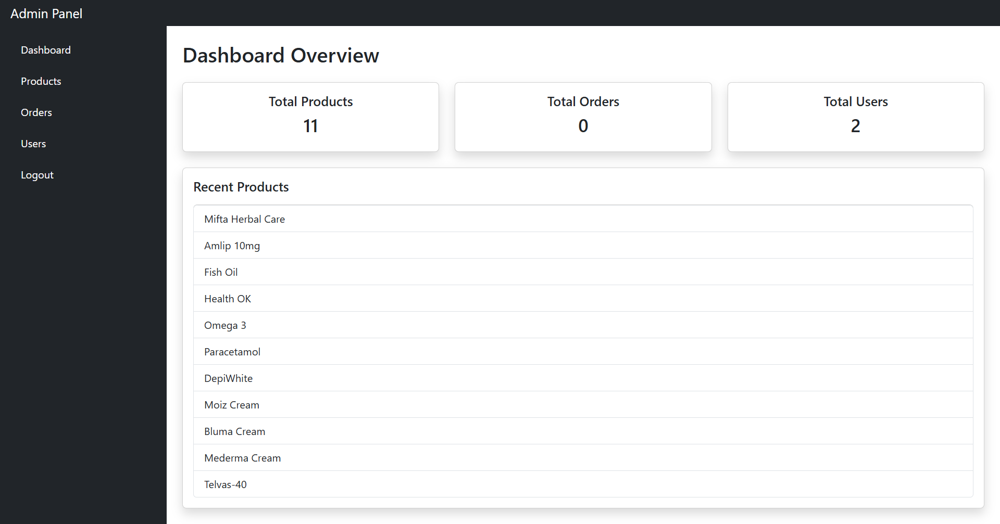
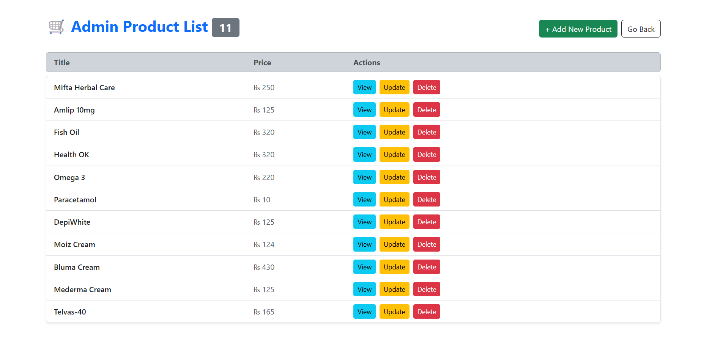
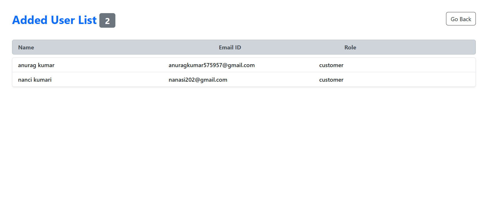
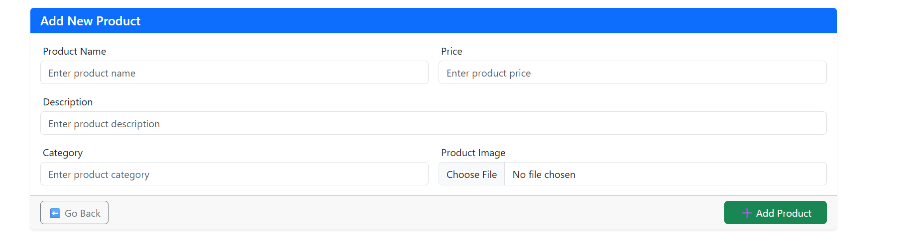
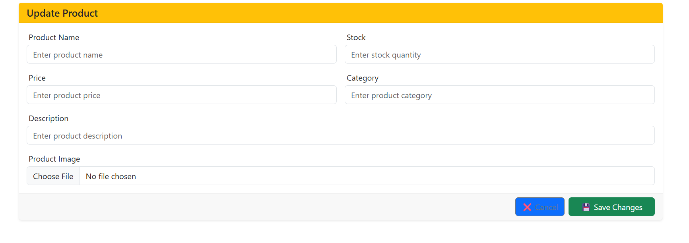

# 🛠️ E-Commerce Admin Panel

A full-featured admin dashboard built for managing an e-commerce platform.  
This panel allows administrators to handle products, users, and monitor platform activity efficiently.

---

## 🚀 Features

### 🔐 Authentication

- Admin login & logout
- Secure access control

### 📦 Product Management

- Add new products
- Update existing products
- Delete products
- View all products

### 🔍 Product Details

- Fetch and display single product details

### 📊 Dashboard Analytics

- Total users count
- Total products count

---

## 🛠 Tech Stack

- React.js
- Redux Toolkit
- Bootstrap
- Node.js (Backend API)
- Express.js (Backend API)
- MongoDB

---

## 📸 Screenshots

### Admin Dashboard



### Product Management



### User Details



### Add Product Page



### Update Product Page



---

## 📦 Installation

```bash
npm install
npm run dev
```
